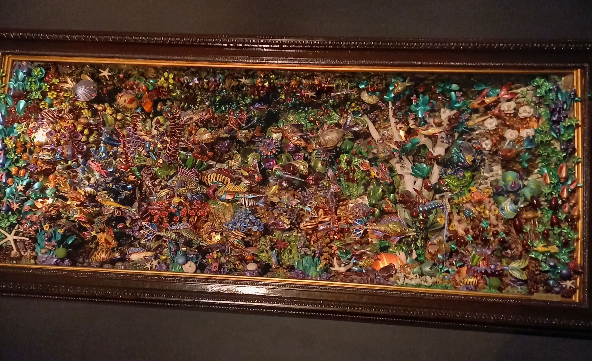
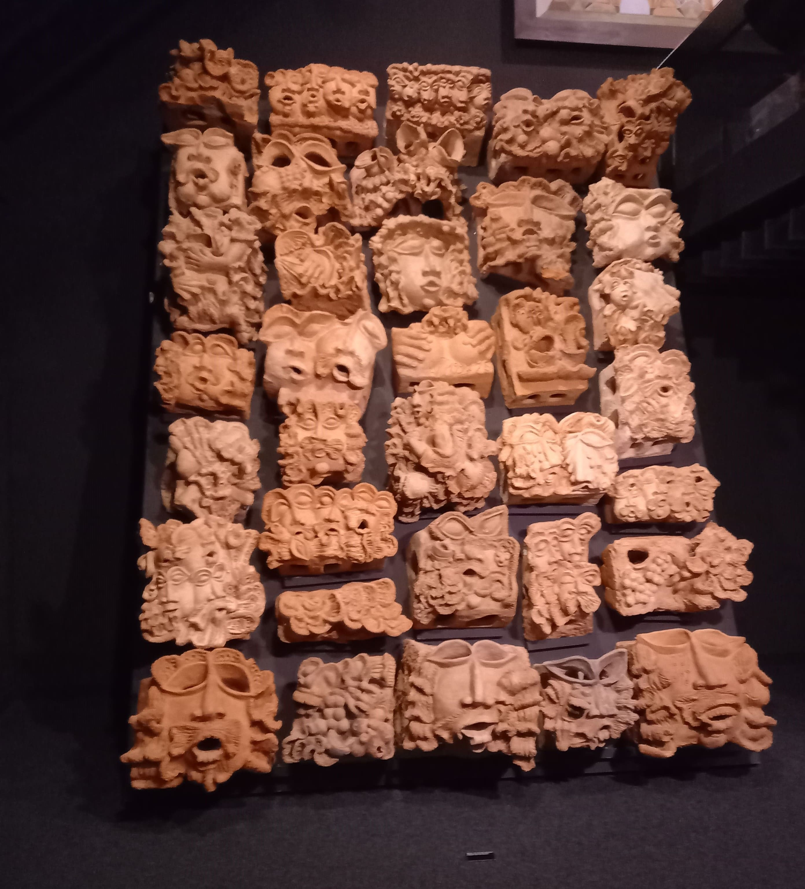
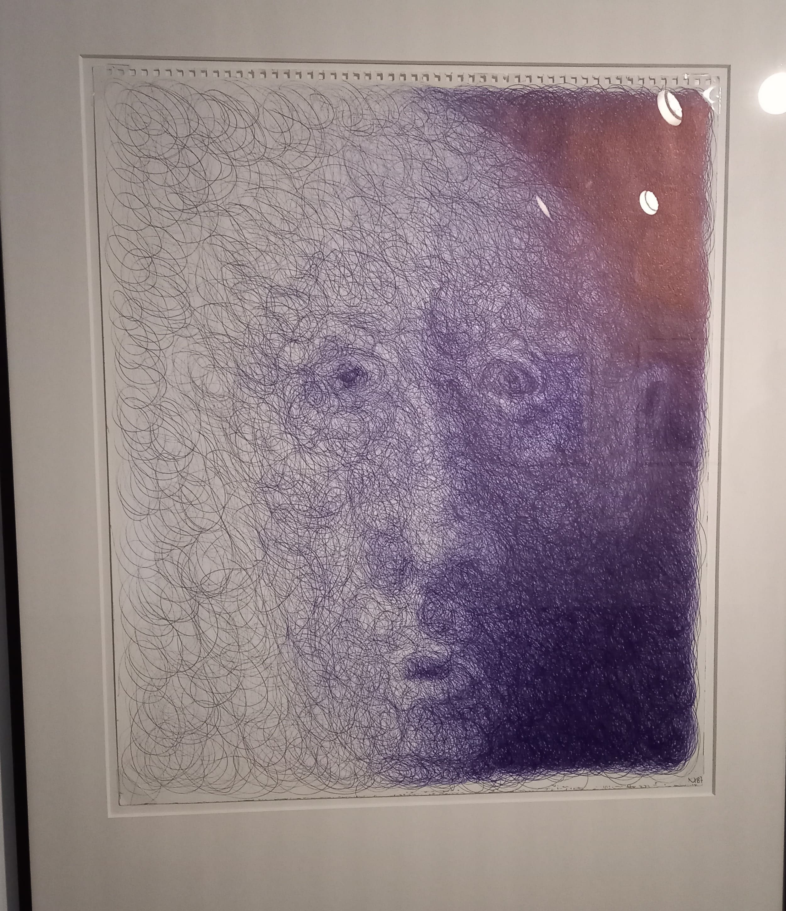

+++
title = "Collection de l`art brut "
date = "2022-09-23"
draft = false
pinned = false
tags = ["Museum", "Lausanne", "Kunst", "Art"]
image = "1486454687_cab_musee-1-.jpg"
+++
Wir teilten unsere Kasse in zwei Gruppen auf. 8 Mädchen gingen ins l\`art brut, die anderen ins Sportmuseum. Am Anfang wollten wir erfahren was überhaupt l\`art brut bedeutet. Wir haben gelernt, dass Art Brut von Autodidakten gemacht wird, die oft am Rande der Gesellschaft leben. Das sind Menschen aus dem Gefängnis, Bewohner aus psychiatrischen Kliniken, Exzentriker, Einzelgänger und Ausgestoßene. Sie sind  kreativ, ohne sich um öffentliche Kritik oder das, was andere Leute denken könnten, zu kümmern. Ihre Bilder haben uns sehr beeindruckt und gefallen. Es waren nicht nur Gemälde, sondern auch Figuren aus Ton, selbst genähte Kleider, Comics... Insgesamt war die Ausstellung interessant. 

