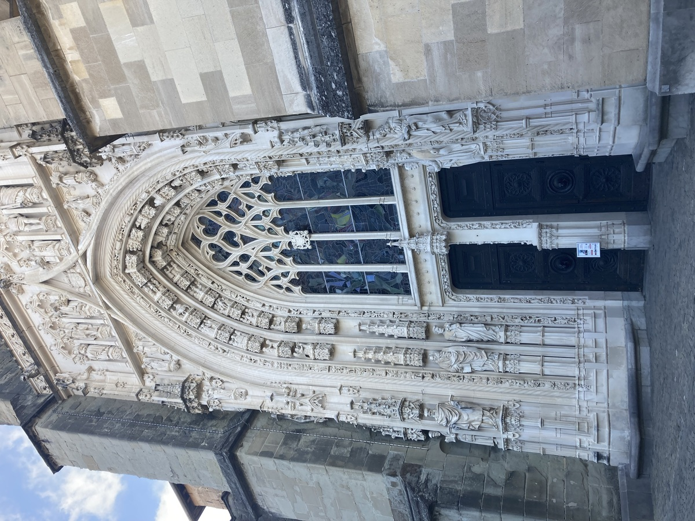

+++
title = "Die Altstadt von Lausanne"
date = "2022-09-23"
draft = false
pinned = false
image = "img_2103-kopie.jpg"
+++
Wie jede Stadt hat Lausanne auch eine schöne Altstadt. Aber was ist eigentlich eine Altstadt und woher kommt der Name überhaupt? Altstadt heisst wörtlich übersetzt «Alte Stadt», aber auch historische Stadt, Stadtkern oder Ortskern. Die Altstadt war früher einmal ganz Lausanne, bis die Bevölkerung immer mehr wuchs und sie die Stadt vergrössern mussten. Darum stehen in einer Altstadt meist die Häuser von früher und alles sieht von der Architektur etwas alt aus. Eine Altstadt ist auch dafür bekannt, dass es kleine winklige Gässchen gibt. Die Stadt Lausanne befindet sich an und auf Hügel und die Altstadt wurde auf einem dieser Hügel gebaut. Um zu ihr zu gelangen, muss man viele Treppen steigen. Diese sind zum Teil überdacht. Rechts und links gibt es viel kleine Läden und zum Teil auch Sitzplätze. Ganz oben befindet sich die Kathedrale Notre-Dame. Diese wurde im Jahr 1165 gebaut. Sie ist ursprünglich eine katholische Kirche, wird heute aber von der reformierten Kirche gebraucht. Ein weiteres wichtiges Gebäude ist das Rathaus mit seinem Glockenturm, welches sich ebenfalls in der Altstadt, am Place de la Palud, befindet. Genauso wie früher sind auch heute dort die Gemeindebehörden untergebracht.

**Unsere Eindrücke**

Uns hat die Altstadt sehr gefallen, da uns die Architektur angesprochen hat und sie uns an die Berner Altstadt erinnert hat. Die Aussicht von der Plattform der Kathedrale Notre-Dame war sehr eindrücklich, denn man konnte die ganze Stadt und den Genfersee überblicken. Etwas anstrengend war das Hochlaufen und Treppensteigen, bis man zur Notre-Dame gelangte. Sehr schön waren die kleinen Läden, die man entdecken konnte.

