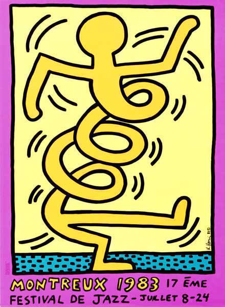

+++
title = "Jazz Festival Montreux"
date = "2022-09-23"
draft = false
pinned = false
tags = ["Montreux", "Musik", "Jazz", "Kunst"]
image = "29259850205_054d17257d_c.jpg"
+++
Dieses Jazz Festival das jedes Jahr in Montreux stattfindet ist Weltbekannt. Jährlich besuchen rund über 250 Tausend Personen dieses mehrtägige, von Claude Nobs gegründetes Festival. Auf den neun Bühnen spielen die verschiedensten Musiker/innen und Bands aus aller Welt (Beispielsweise: Deep Purple, Hollywood Vampires, Tom Mish, etc.). Jedoch spielen nicht nur Jazz orientierte Personen auf diesem Festival, sondern auch Rock, Pop etc. Es findet immer im Juni und im November statt. Wie im Jahr 2019 arbeitet das MJF wieder mit dem Polaris-Festival zusammen. Uns ist aufgefallen, dass das Jazz Festival das ganze Jahr über Präsent ist. Überall in der Jugi und an verschiedenen Stellen in der Stadt waren Plakate aufgehängt. Auch der Gründer Claude Nobs war zahlreich in der ganzen Umgebung in verschiedenen Formen vertreten. Wir haben leider nicht so viel vom Jazz Festival mitbekommen. Jedoch muss es eine Sensation und einen Besuch wert sein, weil die Plakate von grossen Künstlern wie Keith Haring, Jean Tinguely oder Niki De Saint Phalle gestaltet wurden. (Diese Plakate hingen bei uns in der Jugendherberge.) Wie schon gesagt, ist Claude Nobs der Gründer dieses Events. Doch leider ist er mit einem Alter von 77 Jahren 2013  verstorben. Er war ein Saxophonist und ein Leidenschaftlicher Sammler. Er lebte mit seinen über eine Millionen Tonbänder oder Tonaufnahmen in seinem sogenannten Chalets oberhalb von Montreux. Obwohl wir das Festival nicht in Aktion sahen konnten, denken wir das es ein Besuch wert ist.

