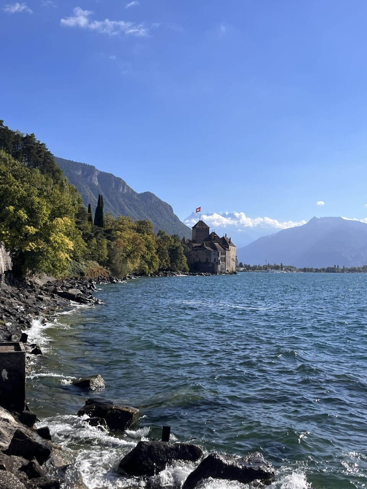

+++
title = "Schloss Chillon "
date = "2022-09-23"
draft = false
pinned = false
tags = ["Montreux", "SchlossChillon", "Waadtland", "Genfersee"]
image = "scloss-chillon-1-.jpg"
+++
### Geschichte des Waadts

Der Name Waadt kommt aus dem latinischen und heisst übersetzt: Land der Wälder. Der Kanton Waadt gehört in der Spätantike- Frühmittelalter zu vielen verschiedenen Reichen. Im Jahr 1798 entstand an Ort des späteren Kantons Waadt der Kanton Léman in der helvetischen Republik. Durch die Mediationsakte von Napoleon tritt der neue Kanton Waadt 1803 selbstständig in den Bund ein. Dabei entstand auch das Wappen. Der Text “Liberté et Patrie“ kommt aus dem Französischen und heisst übersetzt: Freiheit und Vaterland. Die grüne Farbe am Wappen steht für Freiheit. Im Jahr 1874 bestimmte die schweizerische Bundesverfassung Lausanne zum Sitz des Bundesgerichts, das aufgrund der neuen Verfassung zum ständigen Sitz wurde.

### Schloss Chillon

Das Schloss Chillon befindet sich im Kanton Waadt und ist das meistbesuchte Schloss der Schweiz. Pro Jahr besuchen rund 300 000 Personen das Schloss Chillon. Es wurde mit verschiedenen Waffen, Möbel, Rüstungen und weiteren Funden eingerichtet, die das Schloss so aussehen lassen, wie damals eine mögliche Einrichtung des Schlosses ausgesehen hätte. Rund 300 Objekte der Ausstellung stammen von den Ausgrabungen von 1896 bis 1903. Das Schloss gehört zur Kategorie der Wasserschlösser, denn es liegt direkt am Ufer des Genfersees. Es wurde auf einer Felseninsel gebaut, die damals guten Schutz bot, denn früher war das Schloss Wohnsitz der Grafen von Savoyen. Heute ist das Schloss Chillon Besitz vom Kanton Waadt und man kann es jederzeit besuchen gehen. Manchmal finden auch besondere Anlässe im Schloss statt, wie zum Beispiel Kinder Geburtstage.  

Das Schloss sieht von aussen sehr imposant aus. Neben dem Schloss liegt ein kleines Kaffee, welches einen schönen Ausblick bietet. Es ist ein gut erhaltenes Schloss und zeigt Eindrücke in das Frühmittelalter. Es war schade, das Schloss nur von aussen betrachten zu können, trotzdem war es ein schönes Erlebnis.